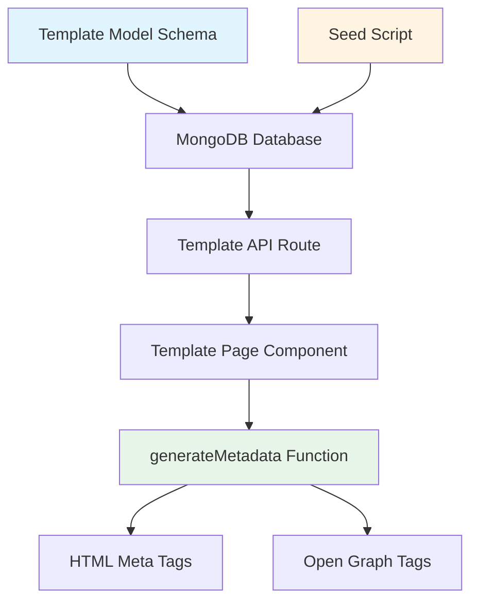

# Design Document: Template SEO Content Expansion

## Overview

This feature enhances the Consumer Complaint Portal's organic search visibility by implementing custom SEO metadata support for template pages. The implementation involves three main components:

1. **Database Schema Enhancement**: Adding optional metadata fields to the Template model
2. **Frontend Metadata Rendering**: Updating the template page to use custom metadata when available
3. **Content Optimization**: Retrofitting 32 existing templates and adding 8 new high-value templates with keyword-optimized metadata

The feature follows a graceful degradation pattern where custom metadata takes precedence, but the system falls back to auto-generated metadata if custom values are not provided. This ensures backward compatibility and allows incremental optimization.

### Key Design Decisions

- **Optional Metadata**: The metadata field is optional to maintain backward compatibility with existing templates
- **Fallback Strategy**: Frontend always checks for custom metadata first, then falls back to auto-generated values
- **Consistency with Guide Model**: The metadata structure matches the Guide model for consistency across the codebase
- **Seed-Based Content Management**: All template content and metadata are managed through the seed script for version control and easy updates

## Architecture

### System Components



### Data Flow

1. **Seeding Phase**: `seedTemplates.ts` → `seed.ts` → MongoDB (Template collection)
2. **Request Phase**: User Request → Next.js Route → MongoDB Query → Template Document
3. **Rendering Phase**: Template Document → `generateMetadata()` → HTML `<head>` tags

### Component Interactions

- **Template Model**: Defines schema with optional metadata field
- **Seed Script**: Populates database with templates including metadata
- **Template Page**: Fetches template data and generates SEO tags
- **generateMetadata Function**: Implements fallback logic for metadata rendering

## Components and Interfaces

### 1. Template Model Schema

**File**: `lib/db/models/Template.ts`

**Current Interface**:
```typescript
export interface ITemplate extends Document {
  title: string;
  slug: string;
  guideRef?: mongoose.Types.ObjectId;
  language: typeof LANGUAGES[number];
  content: string;
  metadata?: {
    title: string;
    description: string;
  };
  downloadCount: number;
  createdAt: Date;
  updatedAt: Date;
}
```

**Schema Definition**:
```typescript
const TemplateSchema = new Schema<ITemplate>({
  // ... existing fields ...
  metadata: {
    title: {
      type: String,
    },
    description: {
      type: String,
    },
  },
  // ... existing fields ...
});
```

**Design Notes**:
- The metadata field is already present in the current schema
- Both title and description are optional strings
- No validation constraints on length (handled at application level)
- Structure matches Guide model for consistency

### 2. Seed Script Template Data

**File**: `lib/db/seedTemplates.ts`

**Template Data Structure**:
```typescript
type TemplateData = {
  title: string;
  language: 'hindi' | 'english' | 'hinglish';
  content: string;
  metadata: {
    title: string;
    description: string;
  };
}
```

**Example Template Entry**:
```typescript
{
  title: 'Amazon Complaint Letter - Hindi',
  language: 'hindi',
  content: `सेवा में,\nग्राहक सेवा विभाग\n...`,
  metadata: {
    title: 'Amazon Complaint Letter - Hindi Format | Draft PDF',
    description: 'Download free amazon complaint letter - hindi format in Hindi. Copy-paste ready draft for consumer court, legal notices, and official complaints. PDF download available.',
  }
}
```

**Metadata Optimization Strategy**:
- **Title Format**: `[Template Name] - [Language] Format | [Value Proposition]`
- **Description Format**: `Download free [template name] in [Language]. [Features]. [Use cases].`
- **Keywords**: Exact match keywords in title, secondary keywords in description
- **Length**: Titles under 70 characters, descriptions under 160 characters

### 3. Frontend Metadata Generation

**File**: `app/(public)/templates/[slug]/page.tsx`

**Current Implementation**:
```typescript
export async function generateMetadata({ params }: { params: Promise<{ slug: string }> }): Promise<Metadata> {
  await connectDB();
  const { slug } = await params;
  const template = await Template.findOne({ slug }).lean();
  
  if (!template) return {};

  const languageLabel = template.language === 'hindi' ? 'Hindi' 
    : template.language === 'english' ? 'English' : 'Hinglish';

  const defaultTitle = `${template.title} - Free ${languageLabel} Format | शिकायत पत्र`;
  const defaultDescription = `${template.title} - Free complaint letter sample in ${languageLabel}. Copy, customize with your details, and submit to the right authority. Ready-made format for Indian consumers. शिकायत पत्र फॉर्मेट।`;

  return createPageMetadata({
    title: template.metadata?.title || defaultTitle,
    description: template.metadata?.description || defaultDescription,
    path: `/templates/${slug}`,
    type: 'article',
    titleAbsolute: true,
    keywords: [
      template.title,
      `${template.title} format`,
      `${template.title} sample`,
      `complaint letter ${languageLabel}`,
      'शिकायत पत्र',
      'complaint letter format India',
    ],
    publishedTime: template.createdAt,
    modifiedTime: template.updatedAt,
  });
}
```

**Fallback Logic**:
1. Check if `template.metadata?.title` exists → use it
2. If not, generate default title from template properties
3. Same pattern for description
4. Pass to `createPageMetadata()` helper which generates all meta tags

**No Changes Required**: The current implementation already supports the fallback pattern correctly.

### 4. Database Seeding Process

**File**: `lib/db/seed.ts`

**Current Seeding Flow**:
```typescript
export async function seedDatabase() {
  // 1. Connect to database
  await connectDB();
  
  // 2. Clear existing data
  await Template.deleteMany({});
  
  // 3. Transform template data
  const templatesWithGuides = templatesData.map((template) => ({
    ...template,
    slug: slugify(template.title),
    guideRef: findRelevantGuide(template),
    downloadCount: Math.floor(Math.random() * 500) + 50,
  }));
  
  // 4. Insert templates
  const templates = await Template.insertMany(templatesWithGuides);
  
  return { templates: templates.length };
}
```

**Execution Command**: `npm run seed`

**Design Notes**:
- Seed script drops all existing templates before inserting new ones
- This ensures clean state and removes any orphaned data
- Download counts are randomized for realistic appearance
- Guide references are automatically matched based on template content

## Data Models

### Template Document Structure

```typescript
{
  _id: ObjectId,
  title: string,                    // "Amazon Complaint Letter - Hindi"
  slug: string,                     // "amazon-complaint-letter-hindi"
  guideRef: ObjectId | undefined,   // Reference to related Guide
  language: "hindi" | "english" | "hinglish",
  content: string,                  // Full template text with placeholders
  metadata: {
    title: string,                  // SEO-optimized title
    description: string             // SEO-optimized description
  } | undefined,
  downloadCount: number,            // Random seed value 50-550
  createdAt: Date,
  updatedAt: Date
}
```

### Metadata Field Specifications

**metadata.title**:
- **Purpose**: Custom page title for search engines
- **Format**: `[Template Name] - [Language] Format | [Value Proposition]`
- **Example**: `"Amazon Complaint Letter - Hindi Format | Draft PDF"`
- **Length**: Target 50-70 characters
- **Keywords**: Primary keywords at the beginning

**metadata.description**:
- **Purpose**: Custom meta description for search results
- **Format**: `Download free [template] in [Language]. [Features]. [Use cases].`
- **Example**: `"Download free amazon complaint letter - hindi format in Hindi. Copy-paste ready draft for consumer court, legal notices, and official complaints. PDF download available."`
- **Length**: Target 150-160 characters
- **Keywords**: Secondary keywords and value propositions

### New Template Specifications

The feature adds 8 new high-value templates targeting specific consumer complaint scenarios:

1. **Cyber Fraud Police Complaint** (Hinglish)
   - Target keywords: cyber fraud complaint, online scam police complaint, UPI fraud
   - Placeholders: fraud_date, amount, bank_name, transaction_id

2. **IRCTC Train Ticket Refund Complaint** (English)
   - Target keywords: IRCTC refund complaint, train ticket refund, TDR claim
   - Placeholders: pnr_number, train_number, cancellation_date

3. **EPF Withdrawal Delay Complaint** (Hindi)
   - Target keywords: EPF withdrawal delay, PF claim complaint, EPFO complaint
   - Placeholders: uan_number, pf_number, claim_id

4. **Loan Recovery Agent Harassment** (English)
   - Target keywords: loan recovery harassment, bank recovery agent complaint
   - Placeholders: loan_account_no, agent_phone_numbers, threat_details

5. **Airlines Baggage Loss or Damage** (English)
   - Target keywords: airlines baggage complaint, lost luggage claim
   - Placeholders: flight_number, baggage_tag_number, pir_number

6. **Ola/Uber Overcharging Complaint** (Hinglish)
   - Target keywords: Ola overcharging, Uber fare dispute, cab complaint
   - Placeholders: ride_id, estimated_fare, charged_fare

7. **Post Office Parcel Missing** (Hindi)
   - Target keywords: post office complaint, speed post missing, India Post
   - Placeholders: tracking_number, booking_date, item_details

8. **Medical Negligence Notice to Hospital** (English)
   - Target keywords: medical negligence complaint, hospital negligence notice
   - Placeholders: patient_name, hospital_name, negligence_description

## Error Handling

### Database Connection Errors

**Scenario**: MongoDB connection fails during seeding
```typescript
try {
  await connectDB();
} catch (error) {
  console.error('❌ Error connecting to database:', error);
  throw error;
}
```

**Recovery**: Script exits with error code 1, allowing retry

### Schema Validation Errors

**Scenario**: Template data doesn't match schema requirements
```typescript
try {
  await Template.insertMany(templatesWithGuides);
} catch (error) {
  console.error('❌ Error inserting templates:', error);
  throw error;
}
```

**Prevention**: 
- Required fields (title, slug, language, content) are always provided
- Optional fields (metadata, guideRef) can be undefined
- Mongoose validates data types automatically

### Missing Metadata Handling

**Scenario**: Template document lacks custom metadata
```typescript
const title = template.metadata?.title || defaultTitle;
const description = template.metadata?.description || defaultDescription;
```

**Recovery**: Automatic fallback to generated metadata ensures pages always have valid SEO tags

### Slug Collision Handling

**Scenario**: Two templates generate the same slug
```typescript
slug: {
  type: String,
  required: true,
  unique: true,  // MongoDB enforces uniqueness
}
```

**Prevention**: 
- Slugify function generates unique slugs from titles
- Template titles are designed to be unique
- MongoDB unique index prevents duplicates

**Recovery**: If collision occurs, seed script fails with clear error message

## Testing Strategy

### Unit Tests

**Test File**: `tests/unit/models/Template.test.ts`

**Test Cases**:
1. Template creation with metadata
2. Template creation without metadata
3. Metadata field validation
4. Schema default values

**Example Test**:
```typescript
describe('Template Model', () => {
  it('should create template with custom metadata', async () => {
    const template = await Template.create({
      title: 'Test Template',
      slug: 'test-template',
      language: 'english',
      content: 'Test content',
      metadata: {
        title: 'Custom Title',
        description: 'Custom Description'
      }
    });
    
    expect(template.metadata?.title).toBe('Custom Title');
    expect(template.metadata?.description).toBe('Custom Description');
  });
  
  it('should create template without metadata', async () => {
    const template = await Template.create({
      title: 'Test Template',
      slug: 'test-template-2',
      language: 'english',
      content: 'Test content'
    });
    
    expect(template.metadata).toBeUndefined();
  });
});
```

### Integration Tests

**Test File**: `tests/e2e/template-seo.test.ts`

**Test Cases**:
1. Verify custom metadata renders in HTML
2. Verify fallback metadata when custom is missing
3. Verify Open Graph tags include custom metadata
4. Verify all 40 templates are accessible

**Example Test**:
```typescript
describe('Template SEO Metadata', () => {
  it('should render custom metadata in HTML', async () => {
    const response = await fetch('/templates/amazon-complaint-letter-hindi');
    const html = await response.text();
    
    expect(html).toContain('<title>Amazon Complaint Letter - Hindi Format | Draft PDF</title>');
    expect(html).toContain('<meta name="description" content="Download free amazon complaint letter');
  });
  
  it('should render fallback metadata when custom is missing', async () => {
    // Create template without metadata
    const template = await Template.create({
      title: 'Test Template',
      slug: 'test-no-metadata',
      language: 'english',
      content: 'Test'
    });
    
    const response = await fetch('/templates/test-no-metadata');
    const html = await response.text();
    
    expect(html).toContain('<title>Test Template - Free English Format');
  });
});
```

### Manual Verification Steps

**After Database Reseeding**:

1. **Verify Template Count**:
   ```bash
   # Connect to MongoDB
   mongosh
   use your_database
   db.templates.countDocuments()
   # Should return 40
   ```

2. **Verify Metadata Presence**:
   ```bash
   db.templates.find({ "metadata.title": { $exists: true } }).count()
   # Should return 40
   ```

3. **Verify New Templates**:
   ```bash
   db.templates.find({ 
     title: { $in: [
       "Cyber Fraud Police Complaint - Hinglish",
       "IRCTC Train Ticket Refund Complaint - English",
       "EPF Withdrawal Delay Complaint - Hindi",
       "Loan Recovery Agent Harassment - English",
       "Airlines Baggage Loss or Damage - English",
       "Ola/Uber Overcharging Complaint - Hinglish",
       "Post Office Parcel Missing - Hindi",
       "Medical Negligence Notice to Hospital - English"
     ]}
   }).count()
   # Should return 8
   ```

4. **Verify Frontend Rendering**:
   - Visit `/templates` page → should show 40 templates
   - Visit a specific template page → view page source
   - Verify `<title>` tag contains custom metadata
   - Verify `<meta name="description">` contains custom metadata
   - Verify Open Graph tags (`og:title`, `og:description`) contain custom metadata

5. **Verify Fallback Behavior**:
   - Temporarily remove metadata from a template in database
   - Reload page → should show auto-generated metadata
   - Restore metadata → should show custom metadata again

### Performance Testing

**Metrics to Monitor**:
- Database query time for template fetch (should be < 50ms)
- Page load time for template pages (should be < 1s)
- SEO metadata generation time (should be < 10ms)

**Tools**:
- Chrome DevTools Performance tab
- Lighthouse SEO audit
- MongoDB query profiling

## Implementation Notes

### Backward Compatibility

The design ensures zero breaking changes:
- Existing templates without metadata continue to work
- Frontend gracefully handles missing metadata
- Database schema allows optional metadata field
- No changes to API contracts

### SEO Best Practices

**Title Optimization**:
- Primary keyword at the beginning
- Include language and format type
- Add value proposition (Draft, PDF, Free)
- Keep under 70 characters

**Description Optimization**:
- Start with action word (Download, Get, Copy)
- Include secondary keywords naturally
- Mention key features and use cases
- Keep under 160 characters
- Include both English and Hindi keywords where relevant

**Keyword Strategy**:
- Target long-tail keywords (e.g., "amazon complaint letter hindi format")
- Include location-specific terms (India, Indian consumers)
- Use exact match keywords in titles
- Use semantic variations in descriptions

### Content Guidelines for New Templates

Each new template must include:
1. **Proper Salutation**: Formal greeting appropriate to recipient
2. **Subject Line**: Clear, concise subject
3. **Body Structure**: Introduction, issue description, demands, closing
4. **Placeholders**: Clearly marked with `{{placeholder_name}}`
5. **Contact Information**: Placeholder for sender details
6. **Date Field**: Placeholder for submission date
7. **Attachments Section**: List of documents to attach

**Placeholder Naming Convention**:
- Use lowercase with underscores: `{{your_name}}`
- Be descriptive: `{{complaint_date}}` not `{{date1}}`
- Group related fields: `{{bank_name}}`, `{{bank_address}}`

### Database Migration Strategy

**No Migration Required**: 
- The metadata field is already present in the schema
- Existing templates without metadata will continue to work
- New templates will include metadata from the start

**Rollback Strategy**:
If issues arise, rollback is simple:
1. Restore previous seed data from version control
2. Run `npm run seed` to restore old templates
3. No schema changes needed

### Deployment Checklist

1. ✅ Verify all 40 templates have metadata in `seedTemplates.ts`
2. ✅ Test seed script locally: `npm run seed`
3. ✅ Verify template count: 40 templates
4. ✅ Test frontend rendering locally
5. ✅ Verify metadata in page source
6. ✅ Run unit tests: `npm test`
7. ✅ Run integration tests
8. ✅ Deploy to staging environment
9. ✅ Run seed script on staging: `npm run seed`
10. ✅ Verify staging templates
11. ✅ Deploy to production
12. ✅ Run seed script on production: `npm run seed`
13. ✅ Verify production templates
14. ✅ Monitor search console for indexing

### Monitoring and Validation

**Post-Deployment Monitoring**:
- Google Search Console: Monitor impressions and clicks for template pages
- Analytics: Track organic traffic to template pages
- Error logs: Monitor for any template rendering errors
- Database: Verify all templates have metadata

**Success Metrics**:
- All 40 templates indexed by Google
- Increase in organic impressions for template keywords
- Increase in organic clicks to template pages
- Improved average position for target keywords

**Timeline**:
- Week 1: Verify indexing and crawling
- Week 2-4: Monitor impression growth
- Month 2-3: Measure traffic and ranking improvements
